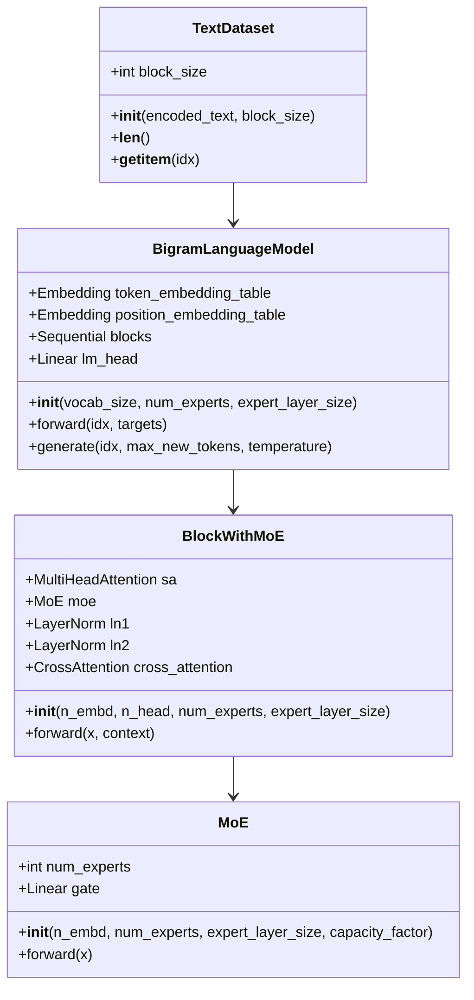
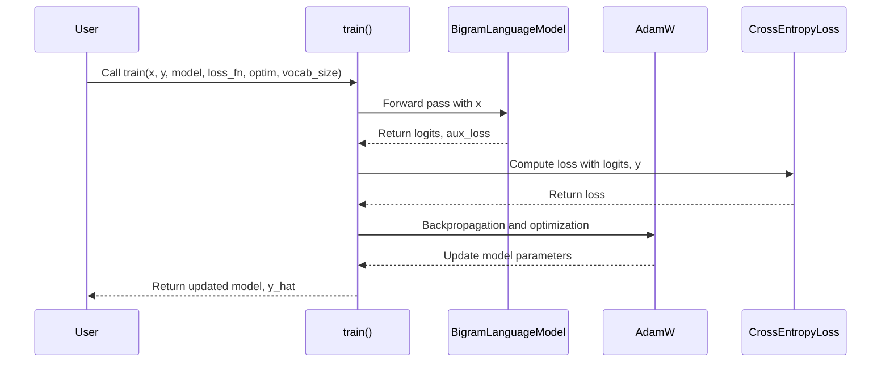

# Code Structure Diagrams

## Class Diagram

```mermaid
classDiagram
    class TextDataset {
        +int block_size
        +__init__(encoded_text, block_size)
        +__len__()
        +__getitem__(idx)
    }

    class MoE {
        +int num_experts
        +Linear gate
        +__init__(n_embd, num_experts, expert_layer_size, capacity_factor)
        +forward(x)
    }

    class BigramLanguageModel {
        +Embedding token_embedding_table
        +Embedding position_embedding_table
        +Sequential blocks
        +Linear lm_head
        +__init__(vocab_size, num_experts, expert_layer_size)
        +forward(idx, targets)
        +generate(idx, max_new_tokens, temperature)
    }

    class BlockWithMoE {
        +MultiHeadAttention sa
        +MoE moe
        +LayerNorm ln1
        +LayerNorm ln2
        +CrossAttention cross_attention
        +__init__(n_embd, n_head, num_experts, expert_layer_size)
        +forward(x, context)
    }

    TextDataset --> BigramLanguageModel
    BigramLanguageModel --> BlockWithMoE
    BlockWithMoE --> MoE
```

## Sequence Diagram for Training

```mermaid
sequenceDiagram
    participant User
    participant TrainFunction as train()
    participant Model as BigramLanguageModel
    participant Optimizer as AdamW
    participant LossFunction as CrossEntropyLoss

    User->>TrainFunction: Call train(x, y, model, loss_fn, optim, vocab_size)
    TrainFunction->>Model: Forward pass with x
    Model-->>TrainFunction: Return logits, aux_loss
    TrainFunction->>LossFunction: Compute loss with logits, y
    LossFunction-->>TrainFunction: Return loss
    TrainFunction->>Optimizer: Backpropagation and optimization
    Optimizer-->>TrainFunction: Update model parameters
    TrainFunction-->>User: Return updated model, y_hat
```
